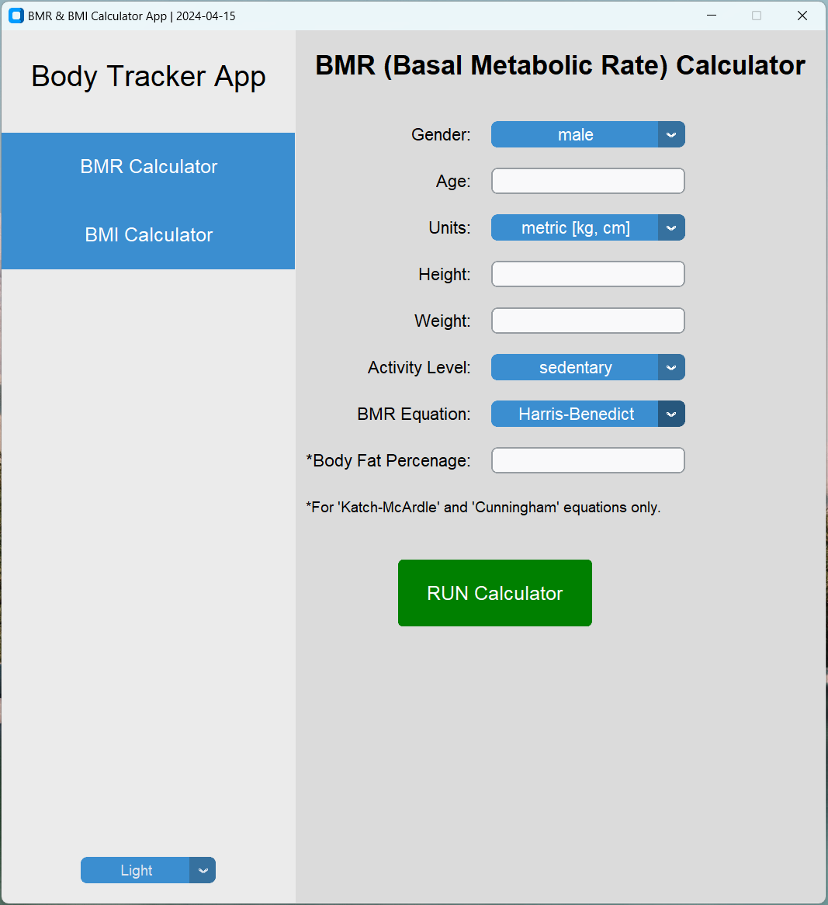
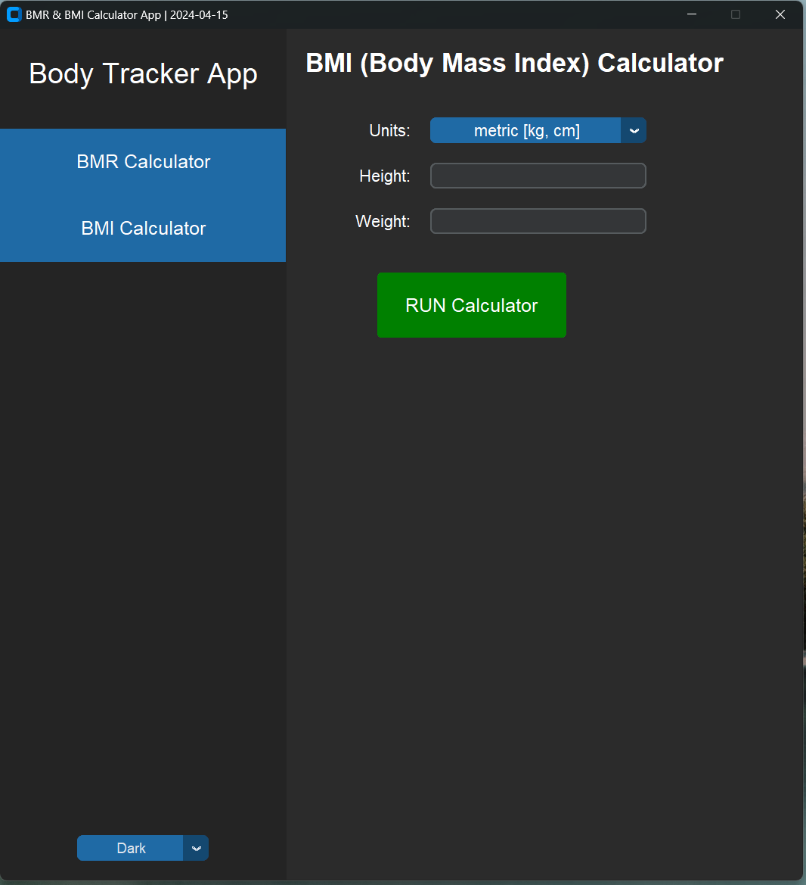

# Body Tracker Application (BMR & BMI Calculator)

This Python GUI application calculates Basal Metabolic Rate (BMR), daily caloric need, Body Mass Index (BMI), and classifies BMI based on given human input of age, gender, weight, and height units, weight, height, specific BMR calculation equation, activity level and body fat percentage.

Upon running the application, the GUI interface will appear. Input the required information (correct input is ensured by input validation) such as age, gender, weight, height, units, activity level, BMR equation, and body fat percentage. Click on the "RUN Calculator" button to generate the results for BMR and BMI calculators.

The theme of the GUI app is adjustable to 'Light' and 'Dark'.

## Features

- Calculate Basal Metabolic Rate (BMR)
- Estimate daily caloric need based on BMR and activity level
- Determine Body Mass Index (BMI)
- Classify BMI based on standard classifications
- Customizable input units and equations

## Libraries used

- tkinter
- customtkinter (Python's standard GUI package)

## Screenshots

*BMR Calculator*

*BMI Calculator*